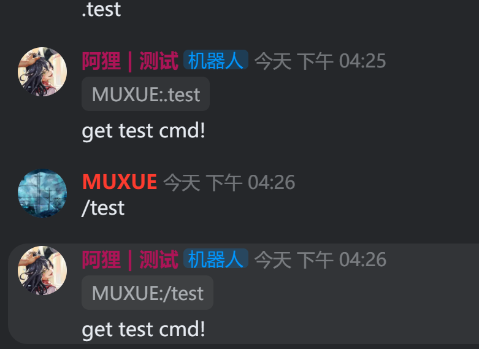
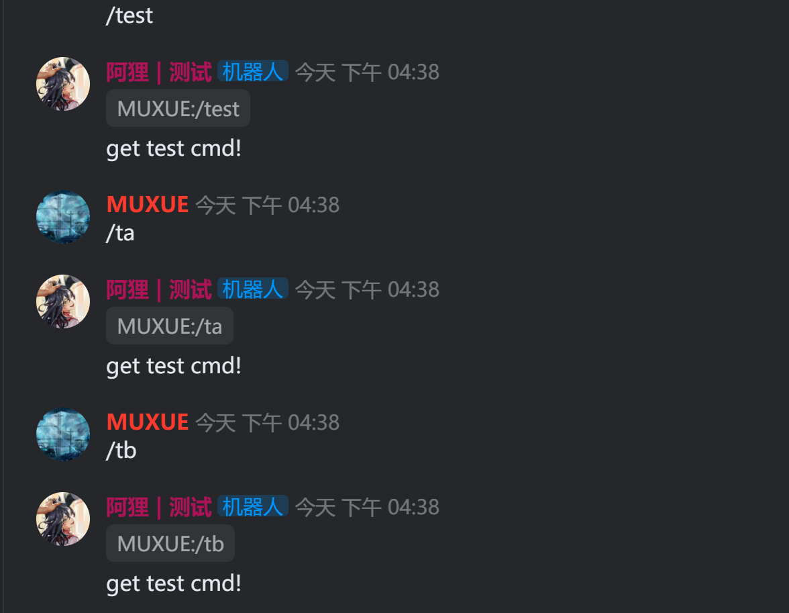
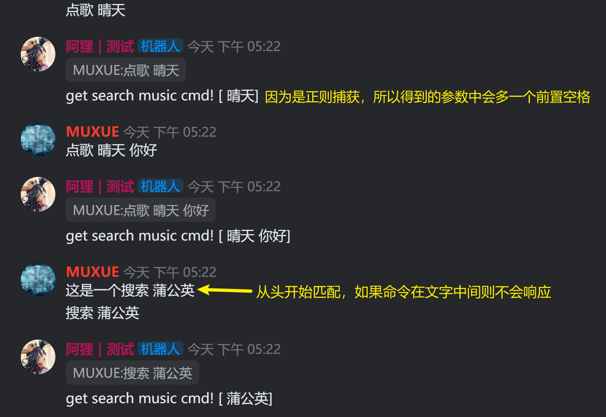
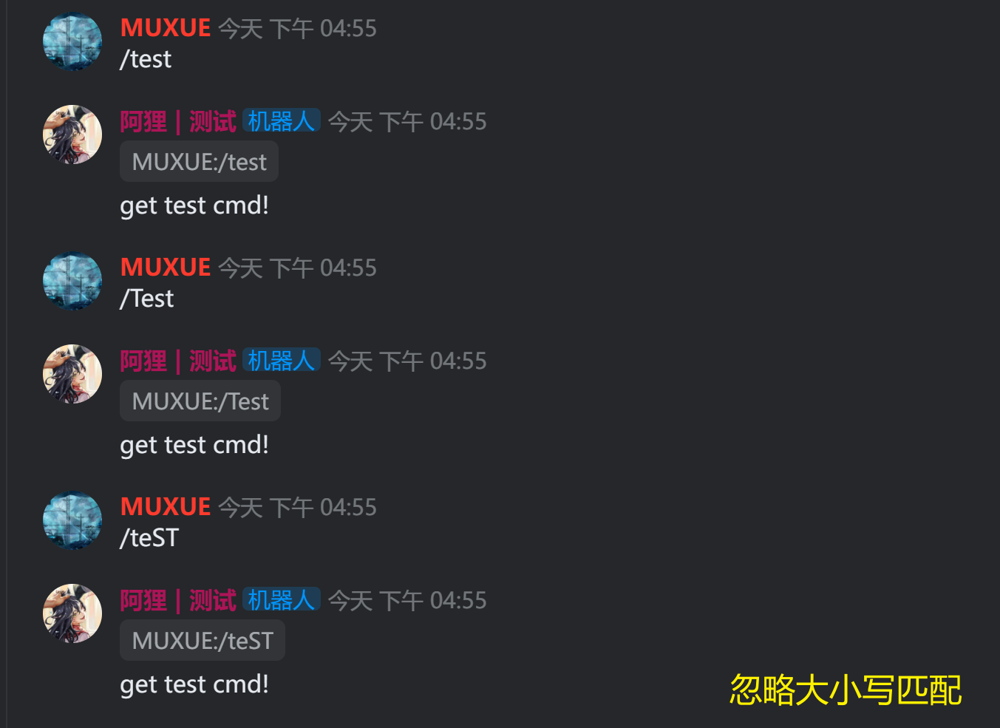
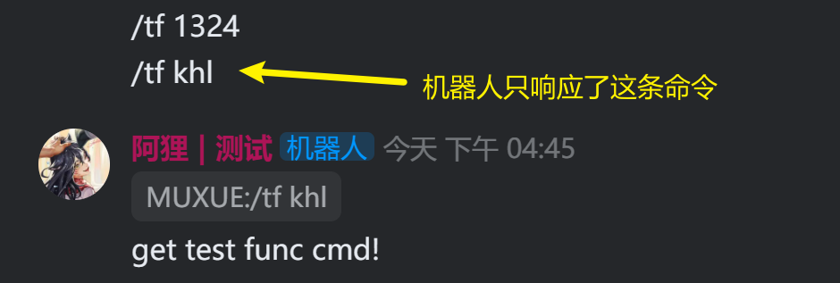
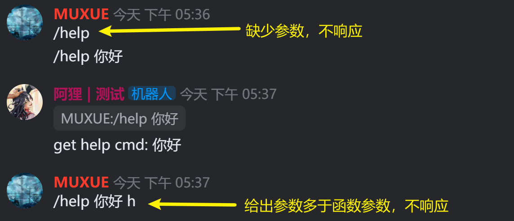
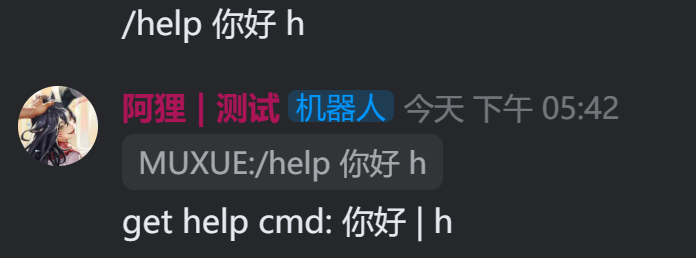
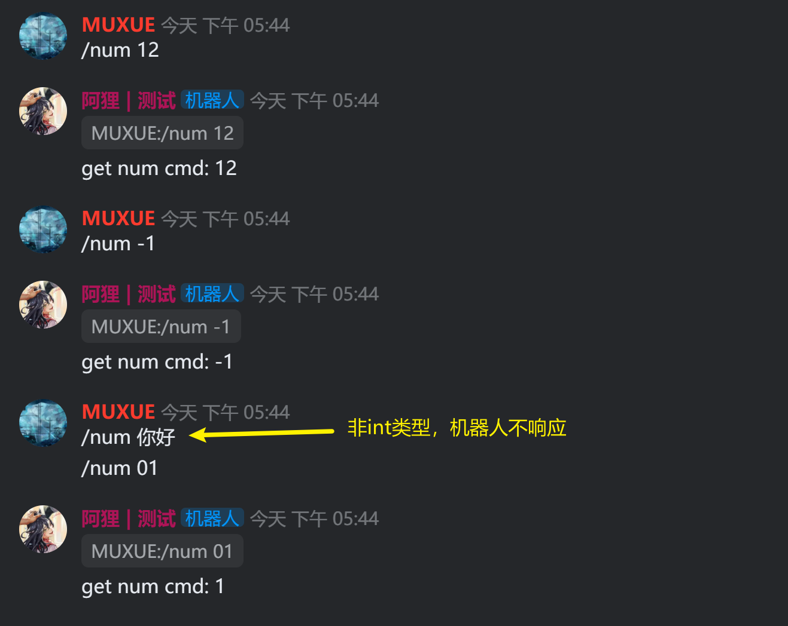
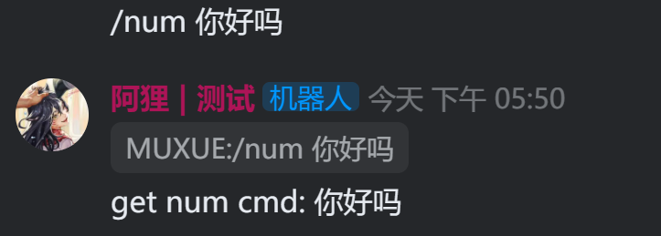
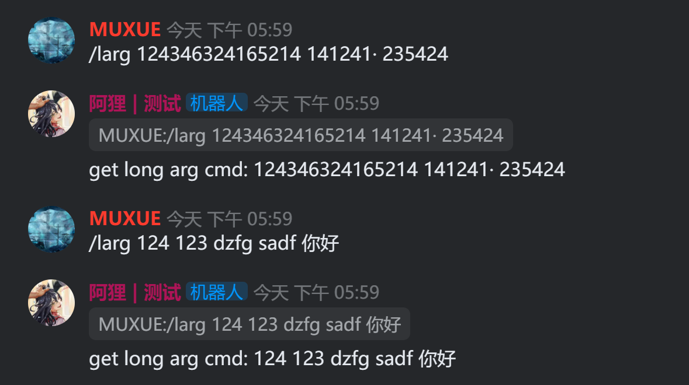

命令注册，就是告诉机器人应该相应什么命令。

> 本页面测试代码可见 [code/06.cmd.py](https://github.com/musnows/khl.py.docs/blob/main/code/05.cmd.py)

## 1.基本框架

注册命令的基本语法如下，包含`@bot.command()`装饰器，以及一个`async def`。所修饰的函数的第一个参数始终为Message对象。

```python
from khl import Message

@bot.command() 
async def hello(msg:Message):
    ...
```

当用户在文字频道中敲出命令名后，机器人会接受用户的命令，并执行hello函数。

## 2.@bot.command相关参数

### 2.1 命令名字 name

在默认情况下，如果没有给装饰器内传入命令名字name，则会采用函数名作为命令名。

比如下方代码，命令名为`hello`，且采用默认前缀`/`，用户需要在kook聊天框输入`/hello`，就能激活这个命令。

```python
@bot.command() 
async def hello(msg:Message):
    ...
```

如果传入命令名name，则会采用该参数作为命令名字。比如如下代码，命令是`/test`；

```python
@bot.command(name="test") 
async def hello(msg:Message):
    ...
```

命令名可以为中文。

### 2.2 命令前缀 prefixes

命令前缀，是用户需要激活某个命令时，应该在命令名之前添加的内容。

khl.py的默认命令前缀是`/`；

假设命令名字是test，在默认情况下，用户需要在文字频道输入`/test`，才能激活该命令。

命令前缀可以通过传入一个字符串列表来设置

```python
@bot.command(name="test", prefixes=['/','.']) 
async def hello(msg:Message):
    ...
```

如上代码中，传入了两个命令前缀。此时在文字频道输入`.test`和`/test`都可以激活该命令。




### 2.3 命令别名 aliases

有的时候，我们希望一个命令能有多个名字，此时就可以使用aliases参数传入一个字符串列表，

```python
@bot.command(name="test",aliases=['tb','ta'])
async def test_cmd(msg: Message):
    ...
```

此时这个命令就有了三个名字，用户可以通过 `/test`、`/ta`、`/tb` 三种方式呼出该命令。别名中的每个字符串含义和name完全一致，没有优先级之分。



### 2.4 正则匹配 regex

如果你对已有的前缀+命令名的匹配方式感觉还不够用，还可以传入regex参数来使用正则表达式来匹配用户的输入。

比如如下代码，匹配的就是搜索和点歌这两个关键字

* `^`  是从头匹配
* `?:` 表示这个括号里的是非捕获组，这个括号里的内容不会被捕获（不会返回在捕获结果里面）
* `|`  就相当于or
* `()` 就是要捕获的东西
* `.+` 简单来说就是匹配后面的东西，无限次匹配


注意，此处引入了命令参数music_name，后文将解释其作用，你可以先忽略它。

```python
@bot.command(regex=r'^(?:搜索|点歌)(.+)')
async def search_music(msg: Message, music_name: str):  # 以字符串匹配一个命令参数
    print("get search music cmd from", msg.author_id)
    print(f"music name [{music_name}]")
    await msg.reply(f"get search music cmd! [{music_name}]")
```

这个命令的作用是监听文字频道，只要用户发送 `搜索 歌名` 或者 `点歌 歌名` 时，都会调用该命令。




### 2.5 忽略大小写 case_sensitive

如果你的英文命令需要忽略大小写匹配，则将该参数设置为False（缺省值为True，即进行大小写全匹配）

```python
@bot.command(name="test",case_sensitive=False)
async def test_cmd(msg: Message):
    ...
```

设置为False后，只要是test这四个字母，无论大小写组合都能呼出该命令。



### 2.6 命令规则 rules

该参数是一个可执行函数的列表，只有列表中的所有函数返回True的时候，命令才会被响应。

对于规则函数而言，其只有一个Message参数，khl会将消息对象传入这个函数来检查结果。该规则函数可以为async def，也可以为普通def。

```python
def test_rules(msg: Message):
    """这是一个命令规则，只有命令中包含khl才能被执行"""
    if 'khl' in msg.content:
        return True
    return False

@bot.command(name="tf",rules=[test_rules])
async def test_func_cmd(msg: Message,text:str): # 以字符串匹配一个命令参数
    """测试命令"""
    try:
        print(f"get test func cmd from",msg.author_id)
        await msg.reply(f"get test func cmd!")
    except:
        print("test func cmd",traceback.format_exc())
```

如下图所示，当我们发送`/tf 1324`时，命令没有被响应。而发送`/tf khl`时，命令被响应。



当命令的rules检查没有通过的时候，这次命令的调用会抛出异常，机器人不会给用户任何反馈。

```
exception raised when handling command: tf
Traceback (most recent call last):
  File "D:\HEXO\khl.py.docs\venv\lib\site-packages\khl\command\command.py", line 143, in handle
    await self._check_rules(msg)
  File "D:\HEXO\khl.py.docs\venv\lib\site-packages\khl\command\command.py", line 173, in _check_rules
    raise Exceptions.Handler.RuleNotPassed(rule)
khl.command.exception.Exceptions.Handler.RuleNotPassed
```

由于这个异常是在`@bot.command`中抛出的，而不是我们编写的`test_func_cmd`函数中抛出的，所以函数体内的try/expect并不能捕获这个异常。而且，该异常中也没有表示是哪一个rules没有检查通过，如果你给定了多个rules，还需要人工debug。

### 2.7 异常处理 exc_handlers

该参数是一个dict，其每个成员是`异常类型:对应的处理函数`，你可以根据需要传入多个处理函数。

异常处理函数必须是async的，它有三个参数，分别是Command，Exception和Message对象，你可以根据编译器的代码和khl.py的源码看看Command和Message对象的成员，从这些对象中取走你需要的成员变量，来进行错误的处理和用户反馈。

如下示例代码中，我们给exc_handlers传入了一个dict，包含了RuleNotPassed异常和对应的处理函数test_exc_handlers。此时如果命令的规则匹配失败，则会直接调用test_exc_handlers处理函数来处理这个异常，终端中也不会出现异常的traceback打印了。

```python
from khl import Bot, Message, command


def test_rules(msg: Message):
    """这是一个命令规则，只有命令中包含khl才能被执行"""
    if 'khl' in msg.content:
        return True
    return False

async def test_exc_handlers(cmd:command.Command, exception:Exception, msg:Message):
    """异常处理函数"""
    print("get exception from", msg.author_id)
    print("exception type:",type(exception))

@bot.command(name="tf",
             rules=[test_rules],
             exc_handlers={command.exception.Exceptions.Handler.RuleNotPassed: test_exc_handlers})
async def test_func_cmd(msg: Message, text: str):
    """测试命令"""
    try:
        print(f"get test func cmd from", msg.author_id)
        await msg.reply(f"get test func cmd!")
    except:
        print("test func cmd", traceback.format_exc())
```

出现异常时的效果如下

```
get exception from 1961572535
exception type: <class 'khl.command.exception.Exceptions.Handler.RuleNotPassed'>
```

### 2.8 help和desc

这两个参数可以用作代码注释，也可以在出现异常时，从exc_handlers的Command对象中取出用于提示用户。

## 3.命令参数

一个操作可能有多个选项或者输入参数，命令参数就是为此而生的。其本质上是我们@bot.command所修饰的函数的参数。

命令参数在文字频道中以空格作为分割，一个空格就代表是一个参数。

### 3.1 单参数示例

下面给出一个最简单的命令行参数的示例。

该命令有一个命令行参数text，此时用户在文字频道输入`/help`时并不会被响应，而需要输入`/help 一些内容`才会被响应。

```python
@bot.command(name="help")
async def help_cmd(msg: Message, text:str):
    """测试命令"""
    print("get help cmd from", msg.author_id, text)
    await msg.reply(f"get help cmd: {text}")
```

如下图所示，当用户输入命令时缺少参数，或参数多于函数参数，机器人都不会响应



三次命令输入，只有中间一次命令被正常调用，其余两次会出现参数长度不匹配的异常。

```
exception raised when handling command: help
Traceback (most recent call last):
  File "D:\HEXO\khl.py.docs\venv\lib\site-packages\khl\command\command.py", line 144, in handle
    self._check_arg_len(to_be_parsed, parsed_args)
  File "D:\HEXO\khl.py.docs\venv\lib\site-packages\khl\command\command.py", line 191, in _check_arg_len
    raise Exceptions.Handler.ArgLenNotMatched(minn, maxx, len(parsed_args))
khl.command.exception.Exceptions.Handler.ArgLenNotMatched
get help cmd from 1961572535 你好
exception raised when handling command: help
Traceback (most recent call last):
  File "D:\HEXO\khl.py.docs\venv\lib\site-packages\khl\command\command.py", line 144, in handle
    self._check_arg_len(to_be_parsed, parsed_args)
  File "D:\HEXO\khl.py.docs\venv\lib\site-packages\khl\command\command.py", line 191, in _check_arg_len
    raise Exceptions.Handler.ArgLenNotMatched(minn, maxx, len(parsed_args))
khl.command.exception.Exceptions.Handler.ArgLenNotMatched
```

### 3.2 多参数示例

和单参数一样，多参数就是给函数添加上你需要的参数即可，具体参数个数根据你的业务来判断。

```python
@bot.command(name="help")
async def help_cmd(msg: Message, text: str, info: str):
    """测试命令"""
    print("get help cmd from", msg.author_id, text, info)
    await msg.reply(f"get help cmd: {text} | {info}")
```

效果如下



控制台输出如下

```
get help cmd from 1961572535 你好 h
```

### 3.3 参数类型

python是弱类型语言，但我们可以通过`:类型`给一个函数的参数指定它的变量类型。这对khl.py的解析也会造成一部分影响。

在下面的示例代码中，我们希望用户传入的参数是一个int类型，即数字。

```python
@bot.command(name="num")
async def num_cmd(msg: Message, index:int):
    """命令参数类型测试"""
    print("get num cmd from", msg.author_id, index)
    await msg.reply(f"get num cmd: {index}")
```

此时如果用户使用一个非数字的参数，机器人不会响应




```
get num cmd from 1961572535 12
get num cmd from 1961572535 -1
exception raised when handling command: num
Traceback (most recent call last):
  File "D:\HEXO\khl.py.docs\venv\lib\site-packages\khl\command\parser.py", line 96, in parse
    arg = await wrap_if_coro(func(msg, client, token))
  File "D:\HEXO\khl.py.docs\venv\lib\site-packages\khl\command\parser.py", line 59, in <lambda>
    int: lambda msg, client, token: int(token),
ValueError: invalid literal for int() with base 10: '你好'

During handling of the above exception, another exception occurred:

Traceback (most recent call last):
  File "D:\HEXO\khl.py.docs\venv\lib\site-packages\khl\command\command.py", line 139, in handle
    parsed_args = await self.parser.parse(msg, client, self.lexer.lex(msg), to_be_parsed)
  File "D:\HEXO\khl.py.docs\venv\lib\site-packages\khl\command\parser.py", line 98, in parse
    raise Exceptions.Parser.ParseFailed(param, token, func, e)
khl.command.exception.Exceptions.Parser.ParseFailed
get num cmd from 1961572535 1
```

而将参数类型声明为str或者不声明参数类型，机器人都能正常响应用户的输入。



简单而言：当你指明了命令行参数类型，khl.py会将该参数转为对应的类型提供给你。但要注意支持的类型仅限于字符串、整数和小数，其余结构化的参数和对象类型，khl.py就没有办法给你转换了。此时会出现如下异常：

```
exception raised when handling command: num
Traceback (most recent call last):
  File "D:\HEXO\khl.py.docs\venv\lib\site-packages\khl\command\command.py", line 139, in handle
    parsed_args = await self.parser.parse(msg, client, self.lexer.lex(msg), to_be_parsed)
  File "D:\HEXO\khl.py.docs\venv\lib\site-packages\khl\command\parser.py", line 92, in parse
    raise Exceptions.Parser.NoParseFunc(param, token)
khl.command.exception.Exceptions.Parser.NoParseFunc
```

你可以给@bot.command传入自定义的Parser来解决这个问题。

### 3.4 函数参数缺省值

除了第一个Message参数外，其余参数都可以给定缺省值。当给定参数缺省值后，用户在使用该命令时就不一定需要传入该参数。

```python
@bot.command(name="help")
async def help_cmd(msg: Message, text: str, info: str=""):
    """测试命令"""
    print("get help cmd from", msg.author_id, text, info)
    await msg.reply(f"get help cmd: {text} | {info}")
```

如上代码中，info给定了空字符串的缺省值，此时`/help 1 2`和`/help 1`都能激活该命令。

注意：Python中函数参数缺省值的规则遵循从右往左提供。

### 3.5 不定长参数

有的时候一个命令需要接受一个包含空格的字符串，比如点歌命令的歌名、搜索命令的搜索内容。我们可以通过可变参数列表来实现这个功能

```python
@bot.command(name="larg")
async def long_arg_cmd(msg: Message,*args):
    """测试命令"""
    print("get long arg cmd from", msg.author_id)
    content = " ".join(args) # 重组为字符串
    await msg.reply(f"get long arg cmd: {content}")
```

如下图所示，此时任意长度的参数（或者没有参数）都可以激活这个命令。



## 4.写在最后

慕雪个人建议，一定要在参数不匹配、异常出错的时候让机器人给出错误的反馈，让用户知道自己的命令输入错误了或者处理失败了。否则，机器人不响应命令很容易被误解为“机器人已下线”，从而让用户放弃操作，影响用户体验。