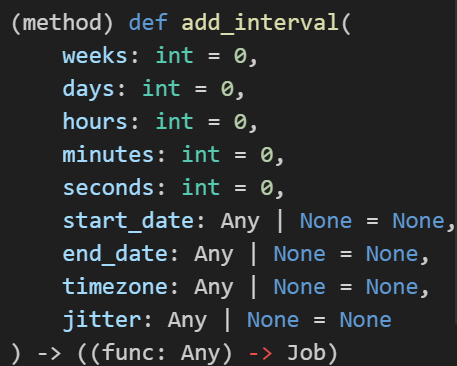
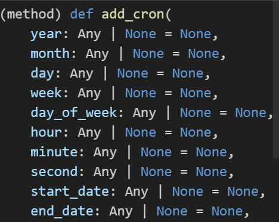

机器人定时任务包含3中不同的方式，其是在`APScheduler`模块上进行的封装

## 1.interval

这是最常用的task类型，其作用是让机器人隔一段时间就来执行一下某一个函数

~~~python
@bot.task.add_interval() # 在这里传入参数，设定任务时间
async def task_interval_def(): # 函数不需要入参
    ...
~~~

具体的参数可以参考编译器的代码补全，所有的参数类型都是字面意思



比如按如下设定，那么机器人就会在开机后开始计时，每1分钟执行一次

~~~python
@bot.task.add_interval(minutes=1)
async def task1():
	...
~~~

你也可以传入多个时间，最终的执行时间是参数的和

~~~python
@bot.task.add_interval(minutes=26,seconds=20)
async def task2():
	...
~~~


## 2.cron

cron类型task是让机器人到指定时间运行函数，比如：

* 每天的1点0分
* 每周周1的0点
* 每月1日的12点
* ...

你可以通过不同的参数设定，来实现在不同的时间段执行对应的函数；

```python
@bot.task.add_cron() # 传入时间设定参数
async def task_cron_def(): # 函数不需要入参
    ...
```

请注意，为了明确该函数执行的时间，**必须**要给`add_cron`传入`timezone`时区参数，如果想使用东八区，请设置参数为 `Asia/Shanghai` 字符串（其余时区自行百度）

~~~python
# 每天早上8点0分执行函数 (东八区)
@bot.task.add_cron(hour=8, minute=0, timezone="Asia/Shanghai")
async def auto_skin_notify_task():
	...
~~~

具体的传参参考IDE的代码补全



在`APScheduler`的类中可以详细看到每一个入参应该如何传入参数；其中`day_of_week`参数既可以传入每周的字符串，如mon代表周一、sun代表周日；又可以传入0到6代表周一到周日。请注意，在这个函数中，每一周的**第一天始终是周一**！

~~~python
class CronTrigger(BaseTrigger):
    """
    Triggers when current time matches all specified time constraints,
    similarly to how the UNIX cron scheduler works.

    :param int|str year: 4-digit year
    :param int|str month: month (1-12)
    :param int|str day: day of month (1-31)
    :param int|str week: ISO week (1-53)
    :param int|str day_of_week: number or name of weekday (0-6 or mon,tue,wed,thu,fri,sat,sun)
    :param int|str hour: hour (0-23)
    :param int|str minute: minute (0-59)
    :param int|str second: second (0-59)
    :param datetime|str start_date: earliest possible date/time to trigger on (inclusive)
    :param datetime|str end_date: latest possible date/time to trigger on (inclusive)
    :param datetime.tzinfo|str timezone: time zone to use for the date/time calculations (defaults
        to scheduler timezone)
    :param int|None jitter: delay the job execution by ``jitter`` seconds at most

    .. note:: The first weekday is always **monday**.
    """
~~~

