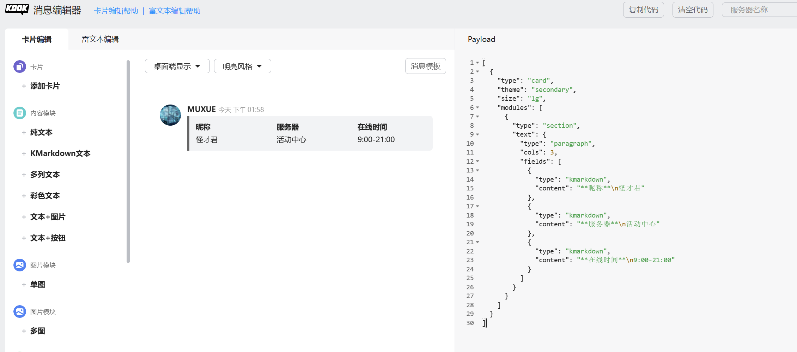
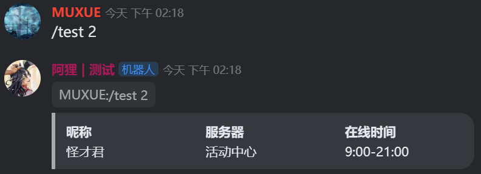
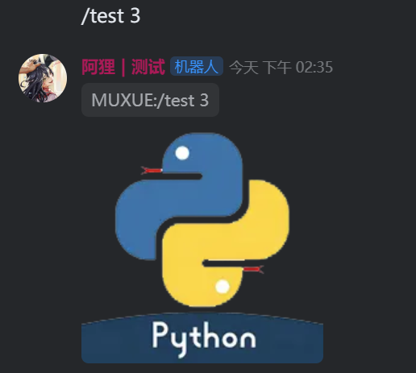
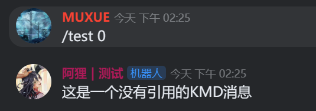

本页面测试代码可见 [code/05.msg.py](https://github.com/musnows/khl.py.docs/blob/main/code/05.msg.py)

## 1.普通消息（KMD）

当你使用kook客户端，直接发送的消息就是普通的文字消息；

新版本的kook已经用KMD完全替换了 `plain text`，所有发送的消息默认都是KMD格式的消息；

KMD是kook使用的基于markdown语法基础上新增了专属功能的一个文字格式，不管你有没有使用过markdown，都还请阅读 [https://developer.kookapp.cn/doc/kmarkdown](https://developer.kookapp.cn/doc/kmarkdown) 内KMD的所有格式。

在khl.py中，机器人默认发送的消息也是KMD格式的

```python
await msg.reply("内容")  # 默认发送的就是KMD消息
```


## 2.卡片消息（CardMessage）

除了最基础的文本消息，kook还有专属的卡片消息，基于json序列化；

卡片消息官方文档：[https://developer.kookapp.cn/doc/cardmessage](https://developer.kookapp.cn/doc/cardmessage)

你可以在官网的 [卡片消息构造器](https://www.kookapp.cn/tools/message-builder.html#/card) 里面构造json的卡片消息，界面如下图：



使用如下方法，可以将消息构造器中卡片消息的json，使用卡片消息的形式发送出去（直接发送会当作字符串以KMD形式发出）;

```python
cm_json = [
    {
        "type": "card",
        "theme": "secondary",
        "size": "lg",
        "modules": [
            {
                "type": "section",
                "text": {
                    "type": "paragraph",
                    "cols": 3,
                    "fields": [
                        {"type": "kmarkdown", "content": "**昵称**\n怪才君"},
                        {"type": "kmarkdown", "content": "**服务器**\n活动中心"},
                        {
                            "type": "kmarkdown",
                            "content": "**在线时间**\n9:00-21:00",
                        },
                    ],
                },
            }
        ],
    }
]
# 发送的时候指定是卡片消息
await msg.reply(cm_json,type=MessageTypes.CARD)
```

发送效果如下图



khl.py内还封装了 Card,CardMessage 等卡片消息的专门处理类，会在卡片消息的文档页中专门说明。


## 3.附件

人如其名，附件消息说的就是图片、文件等等...

你可以使用如下方式，通过上传图片，获取图片链接，再发送一个图片

```python
# 发送图片
img_url = await bot.client.create_asset('./config/logo.png') # 先上传图片并获取链接
await msg.reply(img_url,type=MessageTypes.IMG)
print(f"send img | {img_url}")
```



请注意，直接发送图片仅仅支持发送机器人自己`create_asset`获取的图片链接，其他**非机器人自己上传的图片链接**在发送的时候会产生如下报错（卡片消息中的图片不受此限制）

~~~
khl.requester.HTTPRequester.APIRequestFailed: Requesting 'POST message/create' failed with 40000: 资源不存在
~~~

更多消息类型可以在 `MessageTypes` 类中看到，不常用的消息类型在本文不做演示。欢迎PR添加。

## 4.消息引用

默认情况下，机器人的消息引用始终是打开的，即客户端中的`回复`按钮发送出来的消息。

你可以在`msg.reply`中传入参数禁用消息引用

~~~python
await msg.reply("这是一个没有引用的KMD消息",use_quote=False)
~~~



调用`bot.client.send`或者`channel.send`方法发送的消息，默认是没有消息引用的，你可以通过传入quote参数使其引用某个特定的消息。

```python
msg_id = "需要引用的消息id"
ch = await bot.client.fetch_public_channel("文字频道ID") # 获取频道
await ch.send("test",quote=msg_id) # 发送带消息引用的消息
```

## 5.判断消息类型（私聊/频道消息）

khl.py 中有两个消息类型，分别是 PrivateMessage 和 PublicMessage，分别对应私聊消息和公共文字频道消息。

```python
from khl import PrivateMessage,PublicMessage
# 假设我们有个消息对象msg
if isinstance(msg,PrivateMessage):
    ... # 是私聊消息
else:
    ... # 公共频道消息
```

使用`isinstance`来判断消息对象的类型，即可获知命令的消息来源是私聊还是公共文字频道。