本页面测试代码可见 [code/05.msg.py](https://github.com/musnows/khl.py.docs/blob/main/code/05.msg.py)

## 1.说明

卡片消息的不同格式有很多，基本集中于Card和CardMessage类型中，需要从 `khl.card` 中导入；

~~~python
from khl.card import Card, CardMessage, Module, Types, Element, Struct
~~~

消息发送 `msg.reply()` 函数只接受 CardMessage 对象，一个CardMessage对象最多包含5个Card（超出会无法发送）；

```python
c = Card() # 在这里补充卡片消息的内容（空卡片消息无法发送）
await msg.reply(CardMessage(c))
```

Card和CardMessage本质上是封装了一层Json字符串，CardMessage类型是一个list，你可以使用json模组将其还原成字符串；

```python
cm = CardMessage() # 假设这是一个完好的卡片消息
print(json.dumps(cm)) # 将卡片消息转换成json字符串
```

在卡片消息发送失败的时候，你可以将CardMessage对象转成Json字符串，并去到官方的[卡片编辑器](https://www.kookapp.cn/tools/message-builder.html#/card)中，粘贴Json，查看卡片编辑器底部显示的错误信息。

卡片消息发送失败会触发如下异常：

~~~
khl.requester.HTTPRequester.APIRequestFailed: Requesting 'POST message/create' failed with 40000: 卡片消息json没有通过验证或者不存在
~~~

## 2.文字

除了标题外，正文和小字都支持KMD，在新版本的khl.py中，已经默认了卡片消息的文字类型为KMD

~~~python
cm = CardMessage()
c = Card(
    Module.Header("标题内容，不支持`KMD`"),
    Module.Context("小字，支持`KMD`"),
    Module.Section("正文内容，支持`KMD`"),
)

cm.append(c)
# 你可以继续往cm中append其他Card对象，最多5个
# cm.append(c1)
await msg.reply(cm)
~~~

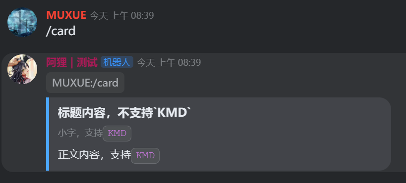

如果你使用的是旧版本的khl.py，则可以使用这种方式来指定文字类型为KMD；同时这里也演示了你可以使用`append`将`Moudle`给插入到Card中，效果和上图完全相同；

~~~python
# 手动指定使用kmd
c1 = Card(
    Module.Header("标题内容，不支持`KMD`")
)
c1.append(Module.Context(Element.Text("小字，支持`KMD`",Types.Text.KMD)))
c1.append(Module.Section(Element.Text("正文内容，支持`KMD`",Types.Text.KMD)))
~~~

**彩色文字**的用法请参考官方卡片编辑器中KMD的语法：

~~~
(font)安全免费(font)[success] (font)没有广告(font)[purple] (font)低资源占用(font)[warning] (font)高通话质量(font)[pink]
~~~


## 3.分行符

~~~python
c1 = Card()
c1.append(Module.Divider()) # 分隔符
~~~

下图小字和正文之间的横线就是分隔符

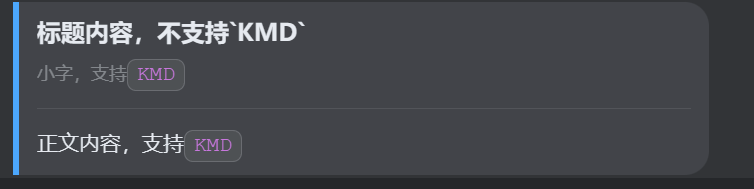

## 4.卡片边栏颜色

在构造`Card`类型的时候，可以传入color参数来指定卡片消息边栏的颜色，默认是蓝色

~~~python
c1 = Card(
    Module.Header("标题内容，不支持`KMD`"),
    color='#1f1f1f'
)
~~~

你可以根据你的需要，传入颜色的十六进制值；可以在[在线网站](https://www.sioe.cn/yingyong/yanse-rgb-16/)中查询颜色对应值，搜索关键字“RGB颜色十六进制码”。

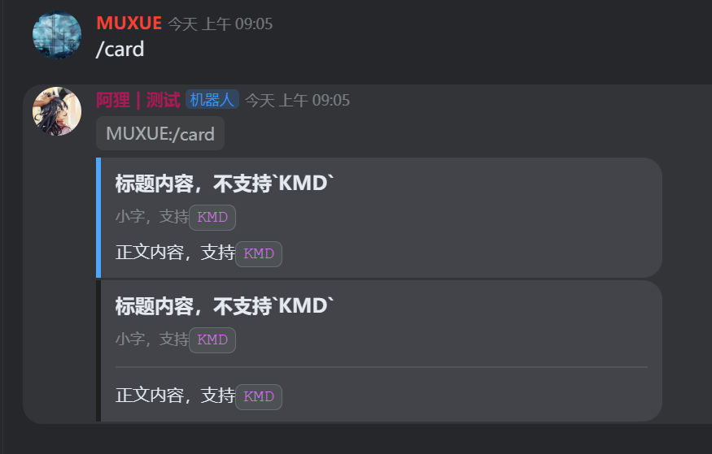

## 5.多列文字

卡片消息支持多列文字，最多3列；在每一列的字符串中换行，既可以实现一列多行。

你可以将第一列加粗来作为“表头”，具体请根据你的需求自行决定样式。

~~~python
c2 = Card(
    Module.Section(
        Struct.Paragraph(
            3,
            Element.Text("这是第一列", type=Types.Text.KMD),
            Element.Text("这是第二列", type=Types.Text.KMD),
            Element.Text("这是第三列", type=Types.Text.KMD),
        )
    )
)
~~~

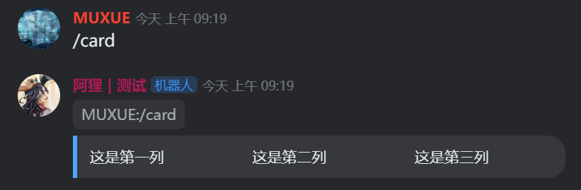

## 6.图片

在卡片消息中，你可以将图片设置成任意**国内可访问**的图片外链链接，也可以先使用`create_asssets`函数将图片上传到kook的图床，获取到链接后，再写入卡片消息中。

请注意，如果你的图片外链国内无法访问或者访问不稳定，则卡片消息会发送失败。强烈建议将图片先上传到kook图床再发送，具体步骤请参考 [图片上传](./02.img.md) 一节；

### 6.1 单图

~~~python
img_src = "https://img.kookapp.cn/attachments/2023-05/29/k2jUQW81GC05k05k.png"
c3 = Card(Module.Container(Element.Image(src=img_src)))
~~~


### 6.2 图片+文字

这里的图片我直接传入了发起命令的用户头像，默认情况下，图片会显示在文字的左侧

~~~python
c4 = Card(
    Module.Section(
        Element.Text("文字在右侧", type=Types.Text.KMD),
        Element.Image(src=msg.author.avatar),
    )
)
~~~

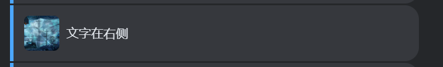

你可以传入mode，让图片显示在文字的右侧

~~~cpp
c5 = Card(
    Module.Section(
        Element.Text("文字在左侧", type=Types.Text.KMD),
        Element.Image(src=msg.author.avatar),
        mode=Types.SectionMode.RIGHT
    )
)
~~~


给`Element.Image`传入sz参数，设置图片的大小，圆角

~~~python
c6 = Card(
    Module.Section(
        Element.Text("文字在左侧", type=Types.Text.KMD),
        Element.Image(src=msg.author.avatar,size=Types.Size.SM,circle=True),
        mode=Types.SectionMode.RIGHT
    )
) # 设置小图+圆角
~~~

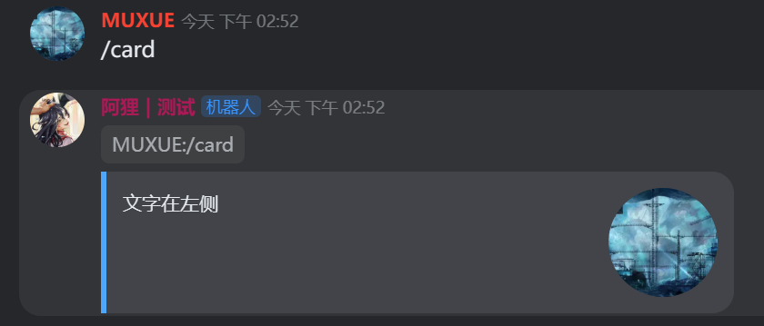

更多大小设置请参考 `Types.Size` 的成员。

### 6.3 多图

使用`ImageGroup`聚合显示多张图片

~~~python
# 多图
c7 = Card(
    Module.ImageGroup(
        Element.Image(src=msg.author.avatar),
        Element.Image(src=msg.author.avatar),
        Element.Image(src=msg.author.avatar),
        Element.Image(src=msg.author.avatar),
    )
)
~~~

图片数量不同，显示的效果也不同

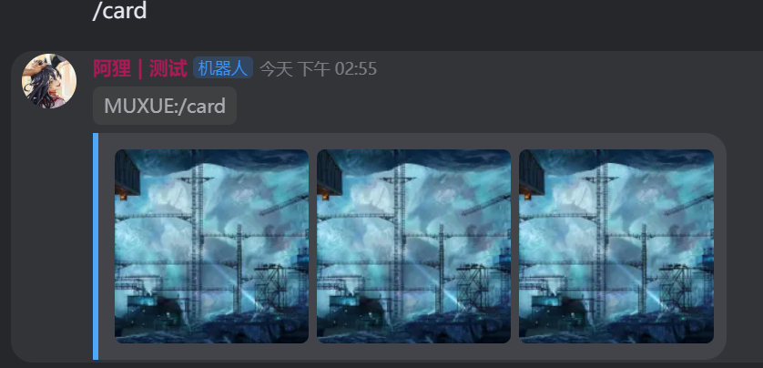


## 7.按钮

### 7.1 参数说明

按钮包含3个参数

* 按钮显示的文字值
* 按钮的value（可以是你设定的字符串，也可以是一个网页链接）
* 点击按钮触发的动作（RETUAN_VAL代表返回事件给机器人，LINK代表跳转链接）
* 按钮主题Theme（按钮颜色，相见`Types.Theme`）

### 7.2 多按钮示例

如下是一个多按钮的示例代码

~~~python
c8 = Card(
    Module.ActionGroup(
        Element.Button("按钮文字1",value='按钮值1',click=Types.Click.RETURN_VAL,theme=Types.Theme.INFO),
        Element.Button("按钮文字2",value='按钮值2',click=Types.Click.RETURN_VAL,theme=Types.Theme.DANGER),
        Element.Button("按钮文字3",value='https://khl-py.eu.org/',click=Types.Click.LINK,theme=Types.Theme.SECONDARY)
    )
)
~~~

消息发送后的效果如下

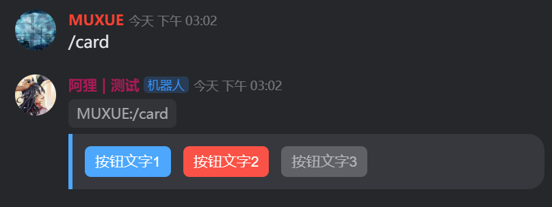

最后一个按钮点击会直接跳转到预先设定好的网页链接，这里不做演示；

### 7.3 按钮点击事件

前两个按钮我都设置成了`RETURN_VAL`，当用户点击这个按钮的时候，会触发一个`BUTTON_CLICK`事件并发送给机器人，我们可以使用`on_event`监听这个时间，并在收到对应的按钮点击事件后，触发操作（比如更新卡片消息实现类似翻页的效果）

~~~python
@bot.on_event(EventTypes.MESSAGE_BTN_CLICK)
async def btn_click_event(b:Bot,e:Event):
    """按钮点击事件"""
    print(e.target_id)
    print(e.body,"\n")
~~~

两个按钮的事件输出如下，其中`e.body['value']`就包含了我们在按钮中设置的value值，您可以根据这个事件的body，来进行对应的一些操作；如果你认为单一字符串的value不符合要求，也可以将按钮的value设置为json字符串以实现更多功能；

~~~
3734705365
{'value': '按钮值1', 'msg_id': '382e4334-cf39-4f82-a9b8-18c97faa54fd', 'user_id': '1961572535', 'target_id': '9534308950818813', 'channel_type': 'GROUP', 'user_info': {'id': '1961572535', 'username': 'MUXUE', 'identify_num': '7134', 'online': True, 'os': 'Websocket', 'status': 1, 'avatar': 'https://img.kookapp.cn/avatars/2022-09/IAzzZG7v8A06j06j.png?x-oss-process=style/icon', 'vip_avatar': 'https://img.kookapp.cn/avatars/2022-09/IAzzZG7v8A06j06j.png?x-oss-process=style/icon', 'banner': '', 'nickname': 'MUXUE', 'roles': [4693884], 'is_vip': False, 'vip_amp': False, 'is_ai_reduce_noise': True, 'is_personal_card_bg': False, 'bot': False, 'decorations_id_map': None, 'mobile_verified': True, 'is_sys': False, 'joined_at': 1658024340000, 'active_time': 1693983764680}, 'guild_id': '3280131482359624'}   

3734705365
{'value': '按钮值2', 'msg_id': '382e4334-cf39-4f82-a9b8-18c97faa54fd', 'user_id': '1961572535', 'target_id': '9534308950818813', 'channel_type': 'GROUP', 'user_info': {'id': '1961572535', 'username': 'MUXUE', 'identify_num': '7134', 'online': True, 'os': 'Websocket', 'status': 1, 'avatar': 'https://img.kookapp.cn/avatars/2022-09/IAzzZG7v8A06j06j.png?x-oss-process=style/icon', 'vip_avatar': 'https://img.kookapp.cn/avatars/2022-09/IAzzZG7v8A06j06j.png?x-oss-process=style/icon', 'banner': '', 'nickname': 'MUXUE', 'roles': [4693884], 'is_vip': False, 'vip_amp': False, 'is_ai_reduce_noise': True, 'is_personal_card_bg': False, 'bot': False, 'decorations_id_map': None, 'mobile_verified': True, 'is_sys': False, 'joined_at': 1658024340000, 'active_time': 1693983764680}, 'guild_id': '3280131482359624'} 
~~~

### 7.4 按钮+文字

用法和图片+文字很类似

~~~python
        c9 = Card(
            Module.Section(
                Element.Text("这里是文字", type=Types.Text.KMD),
                Element.Button(
                    "这里是按钮",
                    value="按钮值1",
                    click=Types.Click.RETURN_VAL,
                    theme=Types.Theme.INFO,
                ),
            )
        )
~~~

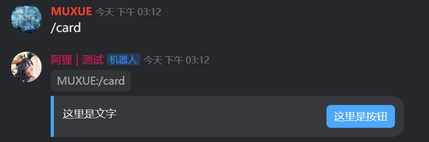

## 8.倒计时

倒计时分为3种不同的形式，在卡片编辑器中预览如下

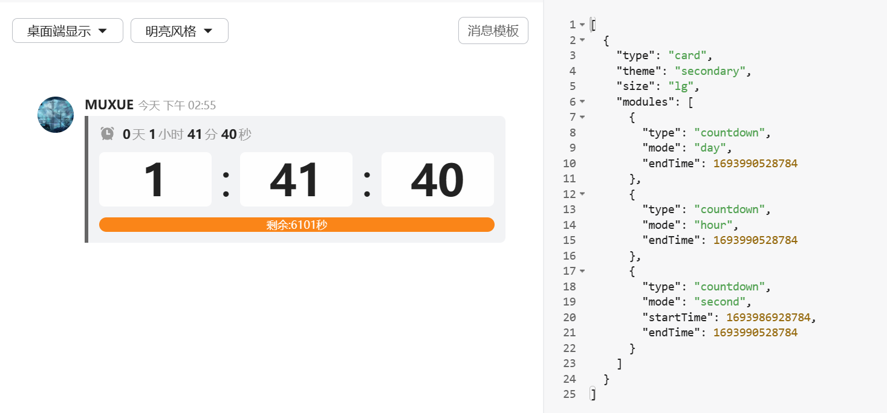

在khl.py中，对应的模块是`Module.Countdown`，这里传入一个datetime类型作为倒计时的时长，传入mode指定倒计时的三种模式

~~~python
c10 = Card(
    Module.Countdown(
        datetime.now() + timedelta(seconds=360000), mode=Types.CountdownMode.DAY
    ),
    Module.Countdown(
        datetime.now() + timedelta(seconds=3600), mode=Types.CountdownMode.HOUR
    ),
    Module.Countdown(
        datetime.now() + timedelta(seconds=3600), mode=Types.CountdownMode.SECOND
    )
)
~~~

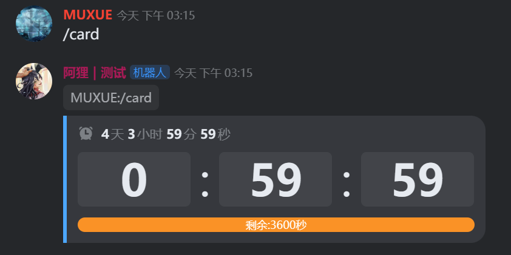

你还可以传入一个start，指定倒计时是什么时候开始的，比如30s前开始倒计时，还剩余60秒

~~~python
        c11 = Card(
            Module.Countdown(
                datetime.now() + timedelta(seconds=60),
                mode=Types.CountdownMode.SECOND,
                start=datetime.now() - timedelta(seconds=30),
            )
        )
~~~

这时候进度条就会变成一个90s的条，并从60s的位置开始继续倒计时

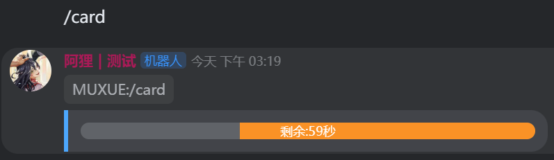